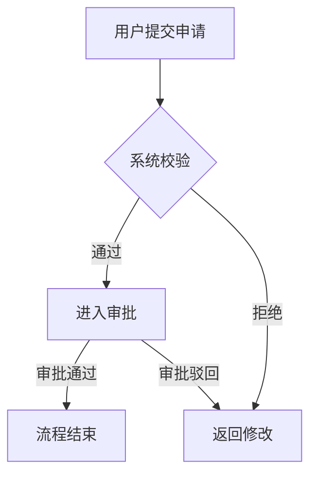

# 需求文档生成器（设计师 PRD 助手）

面向华为计算生态产品团队的需求文档助手。适用于没有专职 BA / 产品经理、由设计师兼任需求工作的团队，帮助以规范流程快速产出可评审、可落地的 PRD。

**业务背景**：鲲鹏、昇腾等计算生态产品，以及 openEuler（欧拉）、openGauss（高斯）、openUBMC 等开源项目。文档不涉及市场营销、盈利模式等内容，聚焦功能需求、用户体验与交付协作。文档默认使用中文撰写。

## 安装方式

本 skill 遵循 Agent Skills 开放标准（一个目录 + 一个 SKILL.md），支持 Claude Code、OpenCode、Codex 主流 AI 编程平台。`<SKILL_SOURCE>` 指本 skill 目录（含 SKILL.md 的 `requirement-doc-generator/` 文件夹）。

**项目级安装（推荐，随仓库分发，团队共享）**

```bash
# 在项目根目录执行，按所用平台复制到对应目录
cp -R <SKILL_SOURCE> .claude/skills/    # Claude Code
cp -R <SKILL_SOURCE> .opencode/skills/  # OpenCode 原生
cp -R <SKILL_SOURCE> .agents/skills/    # Codex（OpenCode 亦兼容此路径）
```

**全局安装（本机所有项目生效）**

| 平台 | 全局路径 |
|------|---------|
| Claude Code | `~/.claude/skills/requirement-doc-generator/SKILL.md` |
| OpenCode | `~/.config/opencode/skills/requirement-doc-generator/SKILL.md`（兼容 `~/.claude/skills/`、`~/.agents/skills/`） |
| Codex | `~/.codex/skills/requirement-doc-generator/SKILL.md`（新版亦支持 `~/.agents/skills/`） |

**验证安装**：Claude Code 会话输入 `/` 查看 skills 列表；OpenCode 由 agent 通过原生 skill 工具按需加载；Codex 用 `/skills` 查看，或提示词中 `$requirement-doc-generator` 显式调用。

**注意**：目录名必须与 frontmatter `name` 一致（`requirement-doc-generator`）；修改后未生效时重启对应 CLI。

## 工作流程

### 第 1 步：交互式提问（必须执行）

使用 AskUserQuestion 工具收集需求要点，规则：

- 每轮不超过 4 个问题，优先提供选项，降低用户输入成本
- 用户回答中出现的新信息即时纳入，避免重复追问
- 必问信息收集齐后立即停止，总计不超过 3 轮
- 若用户一开始就提供了完整信息，可跳过提问直接生成，但需先列出对需求的理解要点请用户确认

### 第 2 步：生成文档

- 输出为 Markdown 文件；除非用户指定目录，保存到 `docs/` 下，命名为 `PRD_[主题]_[YYYYMMDD].md`，例如 `PRD_部署向导_20260827.md`
- 生成后在对话中给出文档结构摘要与评审建议

## 提问清单

1. **所属产品与背景**：涉及哪个产品（鲲鹏 / 昇腾 / openEuler / openGauss / openUBMC / 其他），要解决什么问题？
2. **目标用户与核心场景**：谁在什么情况下使用？（常见用户：开发者、运维工程师、生态伙伴、社区贡献者）
3. **功能范围**：核心功能清单及优先级（P0/P1/P2）
4. **设计输入（可选）**：是否已有原型 / 设计稿 / 交互说明可引用
5. **适配与约束（可选）**：涉及的产品版本、硬件平台、兼容性、依赖系统

## PRD 文档模板

```markdown
# [产品/功能名称] 产品需求文档（PRD）

| 信息 | 内容 |
|------|------|
| 文档版本 | v1.0 |
| 撰写人 | （填写） |
| 更新日期 | YYYY-MM-DD |

## 1. 背景与目标
### 1.1 项目背景（所属产品与生态背景）
### 1.2 问题定义（当前流程 / 工具 / 体验的痛点）
### 1.3 目标与成功指标（体验与效率类指标，必须可量化，如"部署操作步骤从 8 步缩减至 3 步"）

## 2. 用户与场景
### 2.1 目标用户画像（开发者 / 运维工程师 / 生态伙伴 / 社区贡献者）
### 2.2 核心使用场景

## 3. 需求范围
### 3.1 功能清单
| 编号 | 功能 | 描述 | 优先级 |
|------|------|------|--------|
| PRD-001 | | | P0 |

### 3.2 适配范围（涉及的产品、版本、硬件平台，如 openEuler 24.03 LTS、鲲鹏服务器）
### 3.3 本期不做（Out of Scope）

## 4. 功能需求详述
（每个功能包含：需求描述 / 业务流程图 / 交互与原型说明 / 字段与规则 / 异常与边界 / 验收标准）

## 5. 非功能性需求
性能 / 安全 / 兼容性 / 可维护性

## 6. 风险与待确认事项

## 7. 附录（术语表、参考文档）
```

## Mermaid 图表使用规范

按需选用，每个文档 2-4 张为宜，不为画图而画图：

| 图类型 | 用途 | 常见位置 |
|--------|------|---------|
| flowchart | 业务流程、操作路径、审批流转 | 功能需求详述 |
| sequenceDiagram | 多角色/系统交互时序（用户-工具-平台-硬件） | 核心链路 |
| stateDiagram-v2 | 任务/工单/版本等状态流转 | 状态类功能 |
| journey | 用户操作旅程与体验曲线 | 体验优化类需求 |

业务流程示例：



## 质量标准

生成文档前自查：

1. **可测试**：每条需求都有明确验收标准，杜绝"高效、友好、优化体验"等模糊表述
2. **可追溯**：需求编号唯一（PRD-001），便于开发与测试引用
3. **边界完整**：覆盖异常场景与空状态，不只写正常流程
4. **指标量化**：目标用数字表达（操作步骤数、耗时、错误率等），避免"显著提升"这类不可度量的说法
5. **范围清晰**：明确"本期不做"的内容，防止范围蔓延
6. **讲 What 不讲 How**：描述需求本身，不规定技术实现方案

## 写作语气

客观、简洁、主动语态；每句话只表达一个需求点；能用表格就不用长段落。
