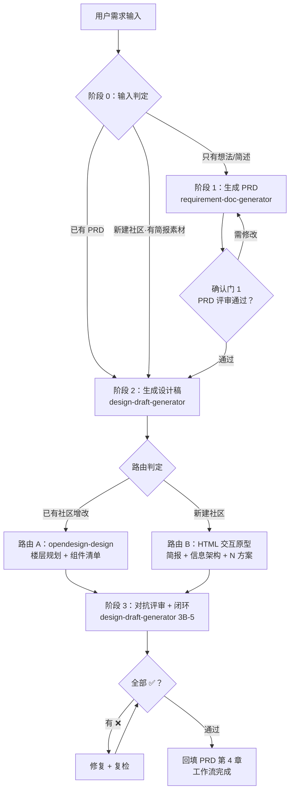

# Design Workflow（需求 → 设计稿 端到端工作流）

面向华为计算生态产品团队（鲲鹏、昇腾、openEuler、openGauss、openUBMC 等）的设计工作流：由三个 Agent Skill 组成流水线，把"想法 → PRD → 设计稿 → 评审闭环"跑成一条可恢复、可追溯的流水线。

## 工作流总览



| 阶段 | 执行 skill | 核心动作 | 通过条件 |
|------|-----------|---------|---------|
| 0 输入判定 | design-workflow | 判定从哪进入，避免重复劳动 | 入口确定 |
| 1 PRD 生成 | requirement-doc-generator | 提问 → 生成 `docs/PRD_[主题]_[YYYYMMDD].md` | 用户确认通过 |
| 2 设计稿生成 | design-draft-generator | 路由判定 → 预消化/简报 → 生成 `design/prototype_*.html` | 设计稿产出 |
| 3 对抗评审 + 闭环 | design-draft-generator（3B-5） | 7 项检查表 → 修复闭环 → 回填 PRD | 全部 ✅ + 回填完成 |

## 三个 Skill

| Skill | 角色 | 说明 |
|-------|------|------|
| [requirement-doc-generator](.trae/skills/requirement-doc-generator/SKILL.md) | 阶段 1 执行者 | 交互式提问生成 7 章标准化 PRD，功能编号可溯、验收标准可测试 |
| [design-draft-generator](.trae/skills/design-draft-generator/SKILL.md) | 阶段 2-3 执行者 | 读取 PRD 判定路由：已有社区走路由 A（委托 opendesign-design），新建社区走路由 B（HTML 交互原型）；生成后强制对抗评审 |
| [design-workflow](.trae/skills/design-workflow/SKILL.md) | 编排器 | 阶段流转、确认门、交接物清单管理；不重复执行 skill 的内部规范 |

三个 skill 均可独立使用；由 design-workflow 编排时形成端到端流水线。

## 关键机制

- **阶段 0 输入判定**：已有 PRD 直接进阶段 2；新建社区有简报走路由 B 快速通道；只有想法从头开始；只要评审直接进阶段 3
- **确认门**：PRD 未经用户确认，禁止生成设计稿
- **交接物清单**：PRD 路径、功能编号索引、路由记录、设计稿路径、评审报告、回填位置——全程维护，兼作上下文压缩后的现场恢复依据
- **对抗评审**：生成者切换为对抗评审者，按 7 项检查表（需求可溯 / 纲领合规 / 五大原则 / CRAP / 视觉细节 / 多方案横向 / 真实可评审）逐项给出 ✅/❌ 与证据，❌ 项修复后复检，全部通过才交付

## 目录结构

```
├── docs/                          # PRD 输出（PRD_[主题]_[YYYYMMDD].md）
├── design/                        # 设计稿输出（prototype_[主题]_[YYYYMMDD].html）
└── .trae/skills/
    ├── requirement-doc-generator/ # 阶段 1：PRD 生成
    ├── design-draft-generator/    # 阶段 2-3：设计稿 + 对抗评审
    │   └── templates/new-community-brief.md  # 路由 B 设计简报模板
    └── design-workflow/           # 编排器
```

## 安装

三个 skill 遵循 Agent Skills 开放标准（一个目录 + 一个 SKILL.md），支持 Claude Code、OpenCode、Codex。项目级安装（推荐）：

```bash
# 在项目根目录执行，按所用平台复制到对应目录
cp -R .trae/skills/<skill-name> .claude/skills/    # Claude Code
cp -R .trae/skills/<skill-name> .opencode/skills/  # OpenCode 原生
cp -R .trae/skills/<skill-name> .agents/skills/    # Codex（OpenCode 亦兼容此路径）
```

路由 A 另需安装 [opendesign-design](https://atomgit.com/openeuler/opendesign-skills/tree/master/skills/opendesign-design) skill（OpenDesign 设计系统规范与硬约束）。

各 skill 的全局安装路径、验证方式见其 SKILL.md 的"安装方式"章节。

## 使用

对 AI 助手说：

- **跑完整流水线**："从需求开始跑一次完整设计工作流"（design-workflow 从阶段 0 接管）
- **只写 PRD**："帮我写一个 XX 的 PRD"（requirement-doc-generator）
- **已有 PRD 出设计稿**："根据 docs/PRD_xxx.md 生成设计稿"（design-draft-generator）

## 设计纲领

两条路由均强制遵守（提炼自《开发者调性》v0.3）：三大理念（Developers over sales / Simple over easy / Doable and searchable）+ 五大原则（简洁 / 准确 / 连贯 / 高效 / 闭环）+ 设计四原则（亲密 / 对比 / 重复 / 对齐）。详见 [design-draft-generator/SKILL.md](.trae/skills/design-draft-generator/SKILL.md)。
