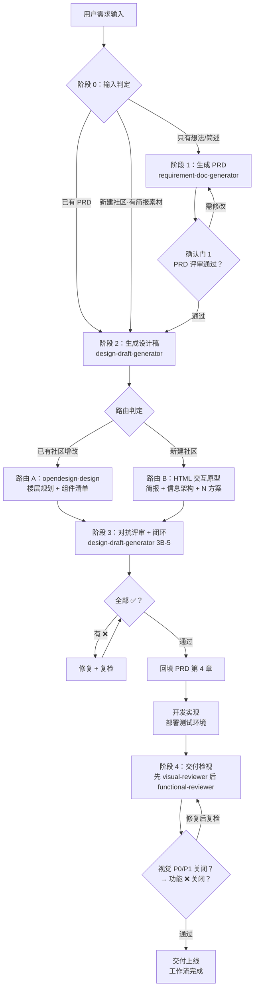

# Design Workflow（需求 → 设计稿 → 交付检视 端到端工作流）

面向华为计算生态产品团队（鲲鹏、昇腾、openEuler、openGauss、openUBMC 等）的设计工作流：由五个 Agent Skill 组成流水线，把"想法 → PRD → 设计稿 → 评审闭环 → 开发交付检视"跑成一条可恢复、可追溯的流水线。

## 工作流总览



| 阶段 | 执行角色 | 对应 skill | 核心动作 | 通过条件 |
|------|---------|-----------|---------|---------|
| 0 输入判定 | 项目主管 | design-workflow | 判定从哪进入，避免重复劳动 | 入口确定 |
| 1 PRD 生成 | 产品经理 | requirement-doc-generator | 提问 → 生成 `docs/PRD_[主题]_[YYYYMMDD].md` | 用户确认通过 |
| 2 设计稿生成 | 体验设计师 | design-draft-generator | 路由判定 → 预消化/简报 → 生成 `design/prototype_*.html` | 设计稿产出 |
| 3 对抗评审 + 闭环 | 设计自检员 | design-draft-generator（3B-5） | 7 项检查表 → 修复闭环 → 回填 PRD | 全部 ✅ + 回填完成 |
| 4 交付检视 | 视觉一致性测试员 → 功能测试员 | visual-reviewer → functional-reviewer | 先测试环境 vs DEMO 还原度比对（P0/P1/P2 分级），P0/P1 关闭后再做设计师清单主基准的关键流程走查 | 视觉 P0/P1 先关闭，功能 ❌ 随后关闭（或有显式风险声明） |

## 五个 Skill = 五种工作角色

流水线以团队协作方式运转，每个 skill 扮演一个贴近日常工作的角色：

| Skill | 扮演角色 | 职责 |
|-------|---------|------|
| [requirement-doc-generator](.trae/skills/requirement-doc-generator/SKILL.md) | **产品经理** | 交互式提问收集需求，产出 7 章标准化 PRD——功能编号可溯、验收标准可测试、边界清晰（"本期不做"明确） |
| [design-draft-generator](.trae/skills/design-draft-generator/SKILL.md) | **体验设计师**（阶段 2）+ **设计自检员**（阶段 3） | 体验设计师：读取 PRD 判定路由——已有社区委托 opendesign-design（路由 A），新建社区产出 HTML 交互原型（路由 B）；设计自检员：生成完成后切换为对抗视角，按 7 项检查表逐项审查自己的产出，❌ 项修复复检，全部通过才交付 |
| [design-workflow](.trae/skills/design-workflow/SKILL.md) | **项目主管** | 编排整个流水线（阶段 0-4）：阶段流转、确认门（PRD 未确认不放行设计）、交接物清单管理；不插手各角色的具体工作 |
| [visual-reviewer](.trae/skills/visual-reviewer/SKILL.md) | **视觉一致性测试员**（阶段 4） | 开发部署测试环境后，逐页比对测试环境与 DEMO 交付物：7 维度（布局/组件/间距/字号/色彩/图标/细节）+ P0 阻断 / P1 偏差 / P2 容忍三级判定，产出证据化报告 `reports/Review_Visual_*.md`；深色背景图标、导航垂直居中、元素截断三类高频问题必查 |
| [functional-reviewer](.trae/skills/functional-reviewer/SKILL.md) | **功能测试员**（阶段 4） | 以体验设计师的功能检视清单为主基准（结合 PRD 交叉校验，不完全依赖），走查测试环境关键流程：P0 主路径+异常路径全覆盖，✅/❌/⛔/➖ 四态判定，产出 `reports/Review_Func_*.md`；清单与 PRD 冲突项回传修订 |

> 同一个 design-draft-generator 在阶段 2 和阶段 3 扮演两个角色：**体验设计师**负责创造，**设计自检员**负责挑刺——生成完成后立即切换视角，假设"这份 demo 一定有问题"，避免自己评审自己的确认偏差。

> 阶段 4 两个检视角色**串行执行**：先视觉一致性测试员比对还原度，P0/P1 全部关闭（实现与 DEMO 一致）后再由功能测试员走查关键流程——视觉未对齐时功能基准错位，易造成返工。两报告独立归档、独立闭环。functional-reviewer 的判定基准由体验设计师定义（功能检视清单 > DEMO 交互说明 > PRD 验收标准），冲突时以设计师清单为准并回传 PRD 修订。

五个 skill 均可独立使用；由 design-workflow 编排时形成端到端流水线（阶段 0-4）。开发实现为流水线外部环节：阶段 3 完成即设计侧交付，用户宣布开发完成、测试环境就绪后由编排器接管阶段 4 交付检视。

## 关键机制

- **阶段 0 输入判定**：已有 PRD 直接进阶段 2；新建社区有简报走路由 B 快速通道；只有想法从头开始；只要评审直接进阶段 3；开发完成、测试环境就绪直接进阶段 4
- **确认门**：PRD 未经用户确认，禁止生成设计稿
- **交接物清单**：PRD 路径、功能编号索引、路由记录、设计稿路径、评审报告、回填位置——全程维护，兼作上下文压缩后的现场恢复依据
- **对抗评审**：生成者切换为对抗评审者，按 7 项检查表（需求可溯 / 纲领合规 / 五大原则 / CRAP / 视觉细节 / 多方案横向 / 真实可评审）逐项给出 ✅/❌ 与证据，❌ 项修复后复检，全部通过才交付
- **交付检视双路径串行**：先视觉还原度检视（测试环境 vs DEMO，7 维度 + P0/P1/P2 分级），P0/P1 关闭后再做功能检视（设计师清单主基准 + 关键流程走查）；两报告独立归档、独立闭环；所有判定证据先行，禁止凭印象判定；修复后只复检影响范围

## 目录结构

```
├── docs/                          # PRD 输出（PRD_[主题]_[YYYYMMDD].md；功能检视清单 FuncChecklist_*.md）
├── design/                        # 设计稿输出（prototype_[主题]_[YYYYMMDD].html）
├── reports/                       # 交付检视报告（Review_Visual_* / Review_Func_*.md）
└── .trae/skills/
    ├── requirement-doc-generator/ # 阶段 1：PRD 生成
    ├── design-draft-generator/    # 阶段 2-3：设计稿 + 对抗评审
    │   └── templates/new-community-brief.md  # 路由 B 设计简报模板
    ├── design-workflow/           # 编排器
    ├── visual-reviewer/           # 阶段 4：视觉还原度检视
    └── functional-reviewer/       # 阶段 4：功能检视
        └── templates/functional-checklist.md  # 设计师功能检视清单模板
```

## 安装

五个 skill 遵循 Agent Skills 开放标准（一个目录 + 一个 SKILL.md），支持 Claude Code、OpenCode、Codex。项目级安装（推荐）：

```bash
# 在项目根目录执行，按所用平台复制到对应目录
cp -R .trae/skills/<skill-name> .claude/skills/    # Claude Code
cp -R .trae/skills/<skill-name> .opencode/skills/  # OpenCode 原生
cp -R .trae/skills/<skill-name> .agents/skills/    # Codex（OpenCode 亦兼容此路径）
```

路由 A 另需安装 [opendesign-design](https://atomgit.com/openeuler/opendesign-skills/tree/master/skills/opendesign-design) skill（OpenDesign 设计系统规范与硬约束）。

各 skill 的全局安装路径、验证方式见其 SKILL.md 的"安装方式"章节。

## 使用

对 AI 助手说：

- **跑完整流水线**："从需求开始跑一次完整设计工作流"（design-workflow 从阶段 0 接管）
- **只写 PRD**："帮我写一个 XX 的 PRD"（requirement-doc-generator）
- **已有 PRD 出设计稿**："根据 docs/PRD_xxx.md 生成设计稿"（design-draft-generator）
- **开发完成做视觉还原度检视**："开发做完了，帮我检视测试环境和 DEMO 的还原度"（visual-reviewer，串行第一步）
- **开发完成做功能检视**："走查一遍测试环境的关键流程"（functional-reviewer，需视觉检视 P0/P1 已关闭；建议先让设计师填写功能检视清单）

## 设计纲领

两条路由均强制遵守（提炼自《开发者调性》v0.3）：三大理念（Developers over sales / Simple over easy / Doable and searchable）+ 五大原则（简洁 / 准确 / 连贯 / 高效 / 闭环）+ 设计四原则（亲密 / 对比 / 重复 / 对齐）。详见 [design-draft-generator/SKILL.md](.trae/skills/design-draft-generator/SKILL.md)。
