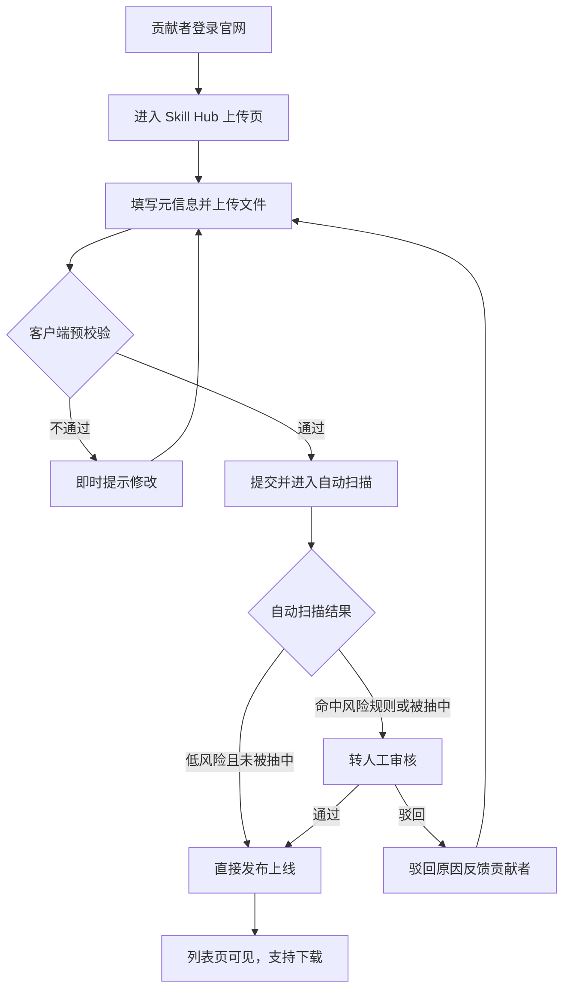
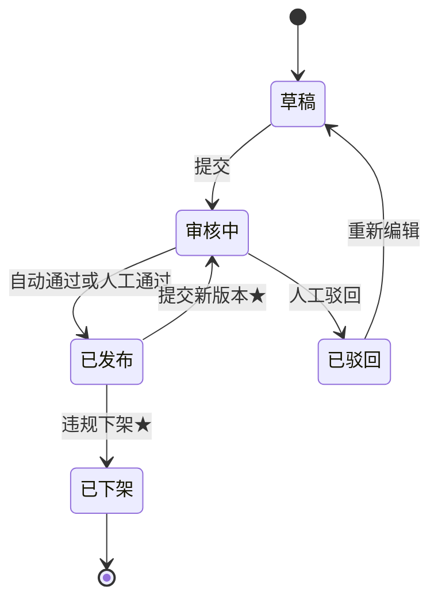
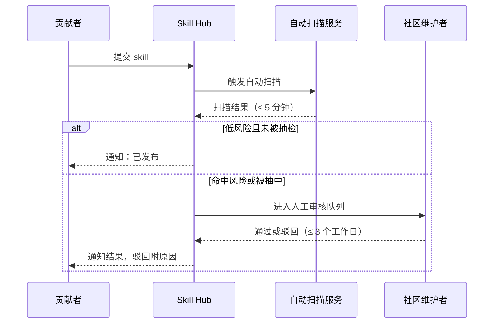

# openEuler 社区 Skill Hub 产品需求文档（PRD）

| 信息 | 内容 |
|------|------|
| 文档版本 | v2.0 |
| 撰写人 | （填写） |
| 更新日期 | 2026-08-27 |

## 1. 背景与目标

### 1.1 项目背景

所属产品：openEuler 开源社区生态工具。随着 AI 辅助开发工具普及，skill（技能包，面向 AI 编程工具的可复用能力单元）成为开发者提升效率的重要资产。社区内已出现多个面向系统运维、性能调优、内核开发等场景的 skill，但分散在不同仓库、论坛与个人主页。Skill Hub 将作为 openEuler 社区官网的组成模块，为生态提供统一的 skill 汇聚与分发入口。

### 1.2 问题定义

1. **Skill 分散难找**：开发者不知道有哪些可用 skill、去哪里下载，检索成本高
2. **缺乏统一规范**：没有标准的元信息定义、上传流程与审核机制，质量参差不齐
3. **生态待激活**：贡献者的 skill 缺乏展示与分发渠道，难以沉淀与传播

### 1.3 目标与成功指标

构建集成于 openEuler 社区官网的 skill 汇聚平台，供开发者上传与下载 skill。

| 指标 | 目标值（上线后 6 个月） |
|------|----------------------|
| 开发者查找并获取所需 skill 的平均耗时 | ≤ 5 分钟 |
| 上架 skill 数量 | ≥ 100 个 |
| 累计下载量 | ≥ 5000 次 |
| 活跃贡献者（上传 ≥ 1 个 skill） | ≥ 30 人 |
| 审核时效 | 自动扫描 ≤ 5 分钟；人工抽检 ≤ 3 个工作日 |

## 2. 用户与场景

### 2.1 目标用户画像

**使用者（下载方）**
- openEuler 生态的开发者、运维工程师
- 需求：快速找到适配当前 openEuler 版本的 skill，一键下载使用

**贡献者（上传方）**
- 社区开发者、SIG 组成员、社区贡献者
- 需求：以低成本上传 skill，获得社区曝光与影响力

### 2.2 核心使用场景

- **场景 A（下载）**：开发者进入官网 Skill Hub，按分类/关键词搜索"性能调优"类 skill，查看详情与适配版本后一键下载
- **场景 B（上传）**：贡献者登录后填写 skill 元信息并上传文件，通过自动扫描与人工抽检后发布，出现在列表页
- **场景 C（治理）**：使用者发现 skill 存在问题或违规内容，提交举报，维护者下架处理

## 3. 需求范围

### 3.1 功能清单

| 编号 | 功能 | 描述 | 优先级 |
|------|------|------|--------|
| PRD-001 | Skill 上传 | 贡献者填写元信息并上传 skill 文件 | P0 |
| PRD-002 | 自动扫描与人工抽检 | 格式/规范/安全自动扫描，风险项转人工抽检 | P0 |
| PRD-003 | 发布与列表展示 | 审核通过后发布，进入 Skill Hub 列表 | P0 |
| PRD-004 | 搜索与筛选 | 关键词搜索 + 分类/版本筛选 | P0 |
| PRD-005 | Skill 详情页 | 展示元信息、说明、适配版本、下载量 | P0 |
| PRD-006 | 一键下载 | 无需登录直接下载，附 hash 校验值 | P0 |
| PRD-007 | 举报与下架 | 举报入口 + 维护者下架 | P1 |
| PRD-008 | 贡献者主页 | 我的上传列表、贡献统计 | P1 |
| PRD-009 | 版本更新 | 已发布 skill 提交新版本，附更新说明 | P1 |
| PRD-010 | 下载量统计 | 详情页与列表页展示下载次数 | P0 |

### 3.2 适配范围

- **平台**：集成于 openEuler 社区官网，复用官网账号体系（SSO）
- **浏览器**：Chrome / Edge / Firefox 最新两个大版本
- **访问方式**：本期仅网页端，不提供 CLI / API
- **skill 版本标注**：上架 skill 需声明适配的 openEuler 版本（如 22.03 LTS / 24.03 LTS）

### 3.3 本期不做（Out of Scope）

- CLI / API 接入（命令行安装 skill）—— 留待二期
- 评分、评论、收藏功能
- 多分支版本管理（本期仅保留最新版本 + 历史版本列表）
- 个性化推荐与热度排行榜
- 独立站点建设（本期集成官网）

## 4. 功能需求详述

### 4.1 Skill 上传与发布（PRD-001 / PRD-002 / PRD-003）

#### 需求描述

贡献者登录后提交 skill：填写元信息、上传文件；系统自动扫描，风险项转人工抽检；通过后发布上线。

#### 权限规则

- 上传需登录官网账号，且账号已完成邮箱验证
- 首次上传前需签署社区贡献者许可协议（CLA），未签署用户进入上传页时引导签署
- 下载、搜索、浏览无需登录，无 CLA 要求

#### 业务流程

#### 交互与原型说明

（待补充：上传表单页、文件上传进度、扫描状态反馈、驳回原因展示的原型链接）

#### 字段与规则

| 字段 | 必填 | 规则 |
|------|------|------|
| Skill 名称 | 是 | 3-64 字符，仅字母/数字/中划线，全站唯一 |
| 版本号 | 是 | 语义化版本 x.y.z |
| 一句话描述 | 是 | ≤ 100 字符，用于列表页展示 |
| 详细说明 | 是 | Markdown，≤ 5000 字符 |
| 分类 | 是 | 单选：系统运维 / 性能调优 / 内核开发 / 编译构建 / 安全加固 / 其他 |
| 标签 | 否 | 最多 5 个，每项 ≤ 20 字符 |
| 适配 openEuler 版本 | 是 | 多选，如 22.03 LTS / 24.03 LTS |
| Skill 文件 | 是 | zip 或 tar.gz，≤ 20MB |
| 开源协议 | 是 | 下拉选择（Apache-2.0 / MIT / MulanPSL-2.0 等） |
| 仓库地址 | 否 | 合法 URL |

#### 审核规则

- 自动扫描项：文件完整性、元信息规范校验、静态安全扫描（恶意代码/敏感内容）、许可证合规
- 转人工条件：命中风险规则，或被随机抽中（抽检比例暂定 10%）
- 人工审核由社区维护者执行，3 个工作日内给出"通过"或"驳回（附原因）"

#### 通知渠道

| 事件 | 通知渠道 | 接收人 |
|------|---------|--------|
| 自动扫描通过并发布 | 站内信 | 贡献者 |
| 人工审核通过并发布 | 站内信 | 贡献者 |
| 人工审核驳回（附原因） | 站内信 | 贡献者 |
| 扫描异常（超时/失败） | 站内信 | 贡献者 |
| 举报处理完成 | 站内信 | 举报人 |

站内信复用 openEuler 官网消息中心；本期不提供邮件通知（留待二期评估）。

#### 异常与边界

- 名称重复：提交时即时提示，不允许进入扫描
- 文件超限/格式错误：提交时拦截并提示
- 自动扫描超时（> 5 分钟）：状态标记"扫描异常"，贡献者可重新触发
- 驳回后重新提交：按新提交时间排队审核
- 同一贡献者单日提交超过 20 个：触发限流

#### 验收标准

- AC1: Given 贡献者已登录 When 按规则填写元信息并上传合法文件 Then 提交成功并进入自动扫描
- AC2: Given 上传文件大于 20MB When 点击提交 Then 拦截并提示"文件超过 20MB"
- AC3: Given skill 名称与已上架重复 When 填写名称失焦 Then 即时提示"名称已存在"
- AC4: Given 自动扫描判定低风险且未被抽中 When 扫描完成 Then 5 分钟内自动发布并出现在列表页
- AC5: Given 人工审核驳回 When 审核完成 Then 贡献者收到驳回原因，skill 不上线
- AC6: Given 自动扫描超过 5 分钟未完成 When 贡献者刷新提交记录页 Then 状态显示"扫描异常"且提供重新触发按钮
- AC7: Given 同一贡献者当日第 21 次提交 When 点击提交 Then 拦截并提示"超出当日提交上限（20 个）"
- AC8: Given 贡献者未签署 CLA When 进入上传页 Then 引导至 CLA 签署流程，签署前不可提交

### 4.2 搜索与下载（PRD-004 / PRD-005 / PRD-006）

#### 需求描述

开发者通过关键词搜索、分类与版本筛选定位 skill，在详情页查看完整信息后一键下载，下载无需登录。

#### Skill 状态流转

（注：带 ★ 的转换依赖 P1 功能，二期交付：提交新版本依赖 PRD-009，违规下架依赖 PRD-007）

#### 交互与原型说明

（待补充：列表页布局、筛选器交互、详情页信息架构、下载按钮状态与空状态页原型链接）

#### 字段与规则

- 搜索：匹配名称、一句话描述、标签，支持关键词分词
- 筛选：分类（单选）、适配版本（多选）
- 排序：默认按更新时间倒序，可切换为按下载量排序
- 详情页展示：全部元信息、详细说明（Markdown 渲染）、下载量、贡献者昵称、文件 SHA-256 校验值
- 下载：无需登录，触发下载时计数 +1，提供原始包下载

#### 异常与边界

- 搜索无结果：展示空状态与分类推荐
- 已下架 skill 的直链访问：展示"该 skill 已下架"提示页，不提供下载
- 下载失败：提供重试入口

#### 验收标准

- AC1: Given 列表页已有数据 When 输入关键词搜索 Then 搜索结果在 P95 ≤ 2 秒内返回
- AC2: Given 未登录用户 When 点击下载按钮 Then 直接开始下载且计数 +1
- AC3: Given 选择"性能调优"分类与"24.03 LTS"版本 When 应用筛选 Then 仅展示同时满足两个条件的 skill
- AC4: Given skill 已下架 When 访问其详情页 Then 展示下架提示，不出现下载按钮
- AC5: Given 搜索关键词无匹配结果 When 返回结果 Then 展示空状态页与分类推荐
- AC6: Given 下载中断或失败 When 用户点击重试 Then 无需重新进入详情页即可重新发起下载

### 4.3 审核交互时序（PRD-002 补充）

### 4.4 举报与下架（PRD-007，P1）

#### 需求描述

使用者在 skill 详情页提交举报（问题描述 + 类型），社区维护者在治理后台核实后对违规 skill 执行下架，下架后前台不可见且不可下载。

#### 交互与规则

- 举报入口位于详情页，需登录，必填：举报类型（质量缺陷 / 违规内容 / 抄袭侵权 / 其他）与问题描述（≤ 500 字符）
- 举报结果通知：通过站内信反馈举报人处理结果
- 下架操作：仅维护者可执行，需填写下架原因；下架后详情页展示"该 skill 已下架"提示
- 下架不影响已产生的下载数据统计

#### 验收标准

- AC1: Given 已登录用户 When 在详情页提交合法举报 Then 举报创建成功并进入治理队列
- AC2: Given 维护者执行下架 When 操作完成 Then skill 从列表页消失，直链访问展示下架提示
- AC3: Given 举报被处理 When 处理完成 Then 举报人收到站内信结果通知

### 4.5 贡献者主页（PRD-008，P1）

#### 需求描述

贡献者的个人聚合页，展示其上传的 skill 列表与贡献统计，供社区了解贡献者情况。

#### 交互与规则

- 入口：详情页贡献者昵称点击进入
- 展示：贡献者昵称、上传 skill 列表（含状态：已发布/审核中/已下架，仅本人可见非已发布状态）、总下载量、累计贡献 skill 数
- 权限：本人可查看全部，他人仅可见已发布内容

#### 验收标准

- AC1: Given 贡献者访问自己主页 When 页面加载 Then 可见其全部上传记录及各状态
- AC2: Given 其他用户访问贡献者主页 When 页面加载 Then 仅展示已发布 skill

### 4.6 版本更新（PRD-009，P1）

#### 需求描述

已发布 skill 的贡献者可提交新版本，附更新说明；新版本走完整审核流程，通过后替换为最新版本，历史版本保留可查。

#### 交互与规则

- 入口：贡献者"我的上传"列表中的"提交新版本"操作
- 必填：新版本号（须大于当前版本）、更新说明（≤ 1000 字符）、新 skill 文件
- 提交后 skill 状态回到"审核中"，审核通过前当前版本保持可下载
- 审核通过后：列表页展示新版本号与更新说明，历史版本在详情页版本列表中可下载

#### 验收标准

- AC1: Given 贡献者提交版本号不大于当前版本的新版本 When 提交 Then 拦截并提示"版本号需大于当前版本"
- AC2: Given 新版本处于审核中 When 用户访问详情页 Then 仍可下载当前版本
- AC3: Given 新版本审核通过 When 审核完成 Then 详情页展示新版本，历史版本在版本列表中可下载

## 5. 非功能性需求

| 类别 | 要求 |
|------|------|
| 性能 | 搜索接口 P95 ≤ 2 秒；列表页首屏加载 ≤ 3 秒 |
| 安全 | 上传文件强制静态扫描；下载文件提供 SHA-256 校验值；开源协议强制展示；上传需登录，下载免登录 |
| 兼容性 | 复用官网账号体系（SSO）；支持 Chrome / Edge / Firefox 最新两个大版本 |
| 可维护性 | 审核服务故障时提交可暂存，服务恢复后自动续处理 |

## 6. 风险与待确认事项

| 风险 | 应对 |
|------|------|
| 冷启动阶段 skill 数量不足 | 正式上线前由官方与 SIG 贡献首批种子 skill（≥ 30 个） |
| 人工审核力量不足导致积压 | 动态调整抽检比例；扩充维护者队伍 |
| 上架 skill 质量风险 | 审核机制 + 举报下架 + 下载 hash 校验 |

**待确认**：

1. skill 文件格式与元信息规范由哪个 SIG 负责制定与维护
2. 人工抽检比例 10% 是否合适
3. 单文件大小上限 20MB 是否满足大体积 skill 的需求
4. 举报处理的责任主体与响应时效承诺
5. 官网账号体系 SSO 接口的对接资源与排期
6. 国际化：是否同步上线中英文双语（openEuler 官网存在中英文站），元信息（一句话描述/详细说明）是否支持双语录入与展示
7. "查找耗时 ≤ 5 分钟"指标的埋点口径（进入列表页到发起下载的时间差，依赖前端埋点，需数据团队确认可行性）

## 7. 附录

### 术语表

| 术语 | 定义 |
|------|------|
| Skill | 面向 AI 编程工具的可复用能力单元，以压缩包形式分发 |
| 元信息 | 描述 skill 的结构化字段（名称、版本、分类等） |
| 抽检 | 对自动扫描判定之外的一定比例提交进行人工审核 |
| 种子 skill | 正式上线前由官方预先准备的示例 skill |

### 参考文档

- openEuler 社区官网架构文档（待补充链接）
- skill 元信息与文件格式规范（待制定，见待确认事项 1）
